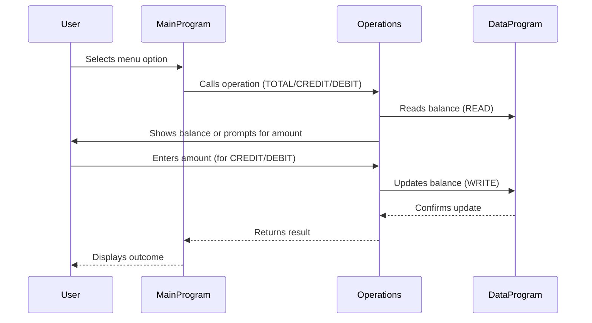

# COBOL Student Account Management System

This project demonstrates a simple account management system for student accounts using COBOL. The system is split into three main COBOL files, each with a distinct purpose and set of business rules.

## Purpose of Each COBOL File

### main.cob
- **Purpose:** Entry point and user interface for the account management system.
- **Key Functions:**
  - Displays menu options: View Balance, Credit Account, Debit Account, Exit.
  - Accepts user input and calls the appropriate operation.
  - Loops until the user chooses to exit.
- **Business Rules:**
  - Only allows choices 1-4; prompts user for valid input.
  - Handles program exit gracefully.

### operations.cob
- **Purpose:** Implements business logic for account operations.
- **Key Functions:**
  - Handles three operations: TOTAL (view balance), CREDIT (add funds), DEBIT (subtract funds).
  - Calls `DataProgram` to read/write balance.
  - Ensures sufficient funds before debiting.
- **Business Rules:**
  - CREDIT: Accepts amount, adds to balance, updates storage.
  - DEBIT: Accepts amount, checks if balance is sufficient, subtracts if possible, updates storage; otherwise, displays an error.
  - TOTAL: Reads and displays current balance.

### data.cob
- **Purpose:** Manages persistent storage of the account balance.
- **Key Functions:**
  - Provides read and write operations for the balance.
  - Stores balance in `STORAGE-BALANCE` variable.
- **Business Rules:**
  - READ: Returns current balance.
  - WRITE: Updates stored balance with new value.

## Business Rules Related to Student Accounts
- Initial balance is set to 1000.00.
- Credit and debit operations update the balance only if valid.
- Debit operation checks for sufficient funds before processing.
- All operations are performed through menu-driven user input.

---

For further details, see the source files in `/src/cobol/`.

---

## Sequence Diagram: Data Flow

